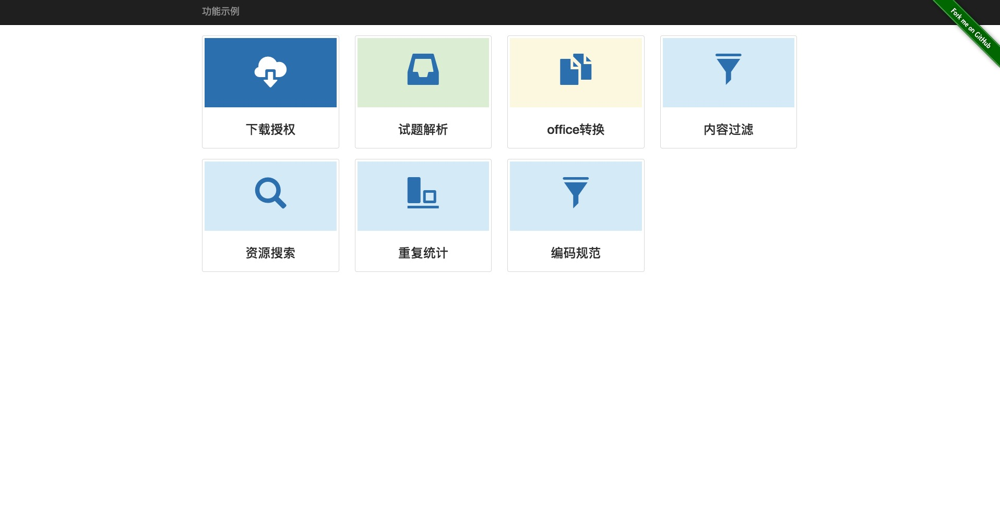

# demo

乐橙谷学堂技术预演项目 [demo 地址](http://demo.i-t-t.cn/ 'Demo')

demo 包含下载授权、试题解析、office 转换、 内容过滤、资源搜索、重复统计、7 个部分。

## 1. 下载授权

环境要求：[nginx](http://nginx.org/)，[Lua](http://www.lua.org/)，[JWT](https://jwt.io)  
依赖包：  
 Lua：

1.  lua-reset-hmac
2.  lua-resty-jwt
3.  lua-resty-string

实现思路：  
 用户点击下载链接时， 服务端进行下载鉴权及授权；鉴权成功后， 发起 302 重定向到资源服务器， 携带授权信息（JWT），资源服务器对授权信息进行校验，校验成功后开始下载资源。
